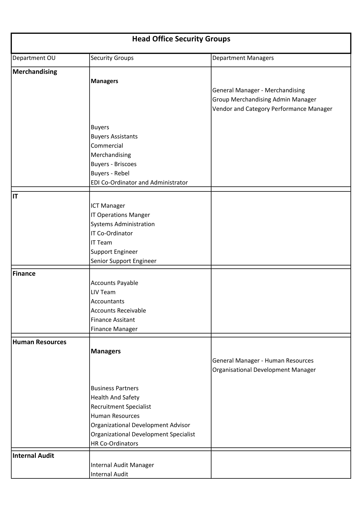
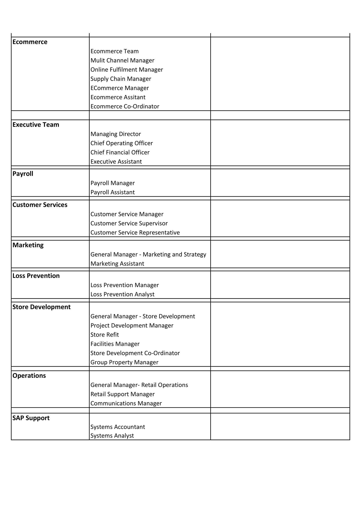

# AD Security Group and Folder Permission Overhaul

### Index
* [Overview](#overview)  
* [Goals](#goals)  
* [Specification](#specificaiton)
* [Process](#process)
    - [Planning](#planning)
    - [Review](#review)
    - [Implementation](#implementation)
* [Milestones](#milestones)

## Overview
Currently access to the network shares is given to an individual by explicitly adding that user onto a folder or file. This goes against [best practises](https://www.netwrix.com/ntfs_permissions_management.html), as well as creating extra workload when onboarding new staff, as a users individual permissions are not easily ascertained or replicated.

This project aims to remedy this by creating a selection of AD Security Groups corresponding the various roles of the Briscoe Group Head Office Employees.

Permissions on the network shares would then be granted based on roles through a selection of security groups, conforming with best practices and reducing the workload when onboarding new staff.

## Goals
* To remove all explicit user permissions on network shares.
* To create standardized access levels based on roles.
* To bring the Network shares into line with best practises.
* To make the onboarding/offboarding process easier.

## Process

#### Planning

**Step 1**  
Create spreadsheet of all current head office job roles  
Align all head office staff members to a role  
Create security group structure, Breakdown by 
- Head Office Security Group OU  
- Department OU  
- Role Security Group  
- Separate nested OU for the Department Managers    

  
  
PDF Available Here [PDF](resources/AD_Security_Group_tree.pdf)

**Step 2**  
Write Powershell script to export user folder permissions.  
Detail which Security Groups are to be applied to each Network share folder.

**Step 3**  
Create Script to add security group along side user on folders.  
Leave for a week to allow changes to propagate.

**Step 4**  
Select a group of test users and remove their explicit permissions from network shares.  
Test if they still have the same access.  

**Step 5**
Remove a Minor departments (Loss Prevention) explict user persmissions from Network Shares.  
Test if they still have the same access

**Step 6**  
Remove a Major departments (Human Resources) explict user persmissions from Network Shares.  
Test if they still have the same access.

**Step 7**
Remove all explicit user permissions.  
Test user access has remained the same.

**Step 8**
Ensure no new explicit permissions are added onto network shares.  
Write Powershell Script to periodically scan through Network Shares and export any explicit user permissions that may have been added.

#### Review

## Milestones

1. Get Sign off from IT Manager and Team Lead to begin Project

2. Create Outline of Proposed Security Group structure and Members.
  
3. Meet with and get sign off for proposed structure from all Department heads.

4. Security Groups created and members added into their respective group.

5. Exported and collated user permissions on network shares.

6. Planned which Security Group to apply to each network share folder.

7. All Security Groups have been added onto folders

8. Test users getting access only through Security Groups

9. First Minor Department getting access only through Security Groups.

10. First Major Department getting access only through Security Groups.

11. All Departments getting access through only Security Groups.

