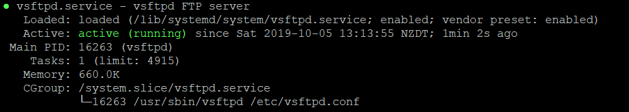

# Setting up FTP

## Index
- Overview
- Install Instructions
- Configuration Instructions

### Installation Instructions

We will be installing this on Ubuntu, for other distubutions replace "apt" with your chosen package manager.  

Update apt repostitory  
`sudo apt update`

Install Vsftpd.  
`sudo apt install vsftpd -y`

Once the install has finished, start the daemon and enable it at start up.  
`sudo systemctl start vsftpd`  
`sudo systemctl enable vsftpd`

Verify the vsftpd service is running.  
`sudo systemctl status vsftpd`  

The output should look similar to the below.

### Configuration Instructions

##### Open the Configuration file.  
`sudo nano /etc/vsftpd/vsftpd.conf`  

##### Turn off anonymous connections.  
We’ll allow access to the FTP server only the local users.  
`anonymous_enable=NO`  
`local_enable=YES`  

##### Enable Uploads.  
Add in this setting to allow changes to the filesystem such as uploading and deleting files.  
`write_enable=YES`  

##### Setup a Chroot Jail.  
This will prevent the FTP users to access any files outside of their home directories.
`chroot_local_user=YES`  

By default, vsftpd will refuse to upload files when chroot is enabled, if the directory that users are locked in is writable. This is to prevent a security vulnerability.  

Use one of the following methods to allow uploads.  

- The recommended method to allow upload is to keep chroot enabled and configure FTP directories.   
We will create an ftp directory inside the user home which will serve as the chroot and a writable uploads directory for uploading files.  
`user_sub_token=$USER`  
`local_root=/home/$USER/ftp`  
   

- Another option is to add the following directive in the vsftpd configuration file. 
 Use this option, if you need to grant writable access on your user, to their home directory.  
`allow_writeable_chroot=YES`

##### Passive FTP Connections
vsftpd can use any port for passive FTP connections.  
Add in the following lines.  
`pasv_min_port=30000`  
`pasv_max_port=31000`  

##### Limiting user login
To allow only certain users to login to the FTP server add the following lines after the `userlist_enable=YES` line.  
When this option is enabled you need to explicitly specify which users are able to login by adding the user names to the /etc/vsftpd/user_list file.  
`userlist_file=/etc/vsftpd/user_list`   
`userlist_deny=NO`  

##### Save and exit the file
`ctrl + 0` to save the file  
`ctrl + x` to exit the file

#### Securing Transmissions with SSL/TLS
In order to encrypt the FTP transmissions with SSL/TLS, you’ll need to have an SSL certificate and configure the FTP server to use it.  

You can use an existing SSL certificate signed by a trusted Certificate Authority or create a self-signed certificate.  
We will be generating a self-signed SSL certificate using the openssl command.  

We will be creating a 2048-bit private key and self signed certificate valid for 10 years. Both the private key and the certificate will be saved in a same file.  

`sudo openssl req -x509 -nodes -days 3650 -newkey rsa:2048 -keyout /etc/vsftpd/vsftpd.pem -out /etc/vsftpd/vsftpd.pem`