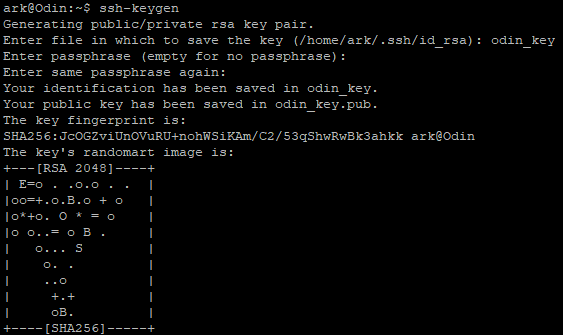
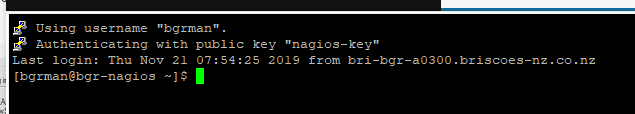
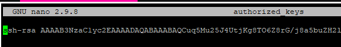

# Configuring SSH
This guide assumes you have followed the installing SSH guide [Here](installing_ssh.md)  

#### Edit The Ssh Config File
Open /etc/ssh/sshd_config and change the configuration within  
`sudo nano /etc/ssh/sshd_config`

#### Change the following lines
**Disable root login**  
`PermitRootlogon no`  
**Change SSH Port**  
`Port ####`  
**Limit SSH access to certain users**  
`AllowUsers user1 user2`  
**Limit Authentication Attempts**  
`MaxAuthTries #` ( Recommended is less than 5)  
**Set SSH Idle Timeout**  
`ClientAliveInterval ###` (Seconds)  
**Disable Empty Passwords**
`PermitEmptyPasswords no`  
**Disable RHosts**  
`IgnoreRhosts yes`  
**Disable Host Based Authentication**  
`HostBaseedAuthentication no`  
**Allow Key Based Authentication**  
`PubkeyAuthentication yes`
**Set A Banner File**  
`Banner /path/to/banner/file`

#### Setup Key Based Logon

##### New Key Pair - Linux
Create a new key pair on your local machine  
`sudo ssh-keygen`  
  
Copy the key to the server  
`ssh-copy-id -i "path/to/pubkey user@hostname`  
Test you can logon using the new key

##### Add Pubkey From Existing Keypair

Open the authorized_keys file
`nano ~/.ssh/authorized_keys`  
Add in your Pubkey string  

Save and close the file  
Resart the SSH daemon
`systemctl restart ssh`
Test connection using Key Based Authentication.

##### Turn off Password based Authentication
Once you have confirmed you can log in using the Key, set the following in the SSH config file.  
`PasswordAuthentication no`
`AuthenticationMethods publickey`

#### Usefull SSH Tools

- [SSH Config Options](https://www.ssh.com/ssh/sshd_config/#sec-Common-configuration-options-for-individual-use) - Full list of all SSH config options and their purpose.

- [Fail2ban](https://www.fail2ban.org/wiki/index.php/Main_Page) - Scans log files and bans IPs that show the malicious signs  
- [Deny Hosts](https://www.cyberciti.biz/faq/block-ssh-attacks-with-denyhosts/) - Is intended to prevent brute force attacks on SSH servers by monitoring invalid login attempts in the authentication log and blocking the originating IP addresses.
- [Geo Ip](http://www.randomdevstuff.com/location-based-ssh-access-using-geoip/) - Each time an external connection is initiated, the script will be executed to identify the region. If the region is not in the allowed list the connection will be dropped
- [SSHGuard](https://www.sshguard.net/) - Protect hosts from brute force attacks against ssh and other services using pf.