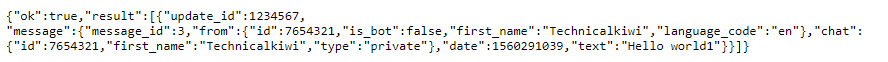

# Introduction
Server Notifications are an important part of any IT persons life.
But to me email seemed so archaic so i wanted to see if i couldnt set up a more modern solution

I came across a few people who were using various messaging services and wanted to have a look. 
So I laid out some requirements

### Requirements
- Push Notifications
- Central Source for all Servers
- Notification History
- Accessible from Multiple Sources
- Ease of Setip

### Decision
After looking at a variety of options including slack, and discord i settles on Telegram as it ticked all the boxes and looked very easy to work with.

# Setup
## Telegram Setup
Create Telegram account  
Login to your new account on your chosen device.
### Bot setup
Start chat with the BotFather  
Create a new bot by typing `/new bot`  
Fill in the bots name, and username (must end with bot)  
The Botfather will reply with the bots API token  
Take note of this Token as it is vital for the bots operation   

Go back and start a chat with your bot to initialize it  
### Notification setup
Go to `https://api.telegram.org/bot$TOKEN/getUpdates`  
Where `$Token` is the API key you received from Botfather  
You should get something similar to the below  

Take note of the Chat ID, in this case 7654321  

### Sending Notifications
Now you have the API token and chat ID
You can send notifications by browsing to
`https://api.telegram.org/bot$TOKEN/sendMessage?chat_id=$CHATID&text=Hello+Mate`
Where `$TOKEN` is the API Token and `$CHATID` is the chat id from above
This will get the bot to send Hello Mate to your telegram account.
Check telegegram and you will have received a message in the chat from the bot.

## Server Setup

Open the pam sshd config file
`sudo nano /etc/pam.d/sshd`
Add in the following line
`session  optional  pam_exec.so /etc/pam.scripts/ssh_alerts.sh`

Create the folder /etc/pam.scripts if need
`sudo mkdir /etc/pam.scripts`
Create the script to execute
`sudo nano /etc/pam.scripts/ssh_alert.sh`
  
Configure and paste the below into ssh_alerts.sh
<pre>#!/bin/bash
TOKEN="Enter API Token Here"
CHATID="Enter Chat ID Here"
URL="https://api.telegram.org/bot$TOKEN/sendMessage"
SERVER="Enter Server Name Here"
TIME="10"
TEXT="
A SSH login was successful, so here is some information for security:
  	User:        $PAM_USER
	Date:        `date`
	Server:      $SERVER
"
if [ ${PAM_TYPE} = "open_session" ]; then
	
    curl -s --max-time $TIME -d "chat_id=$CHATID&disable_web_page_preview=1&text=$TEXT" $URL >/dev/null

    fi
exit 0 </pre>
  
Save and Exit the File.

Test By logging into the server via SSH
You should recieve an alert on telgram

All Done
You can also use this to alert about many other happpenings.