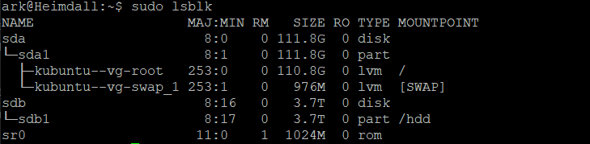
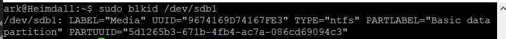
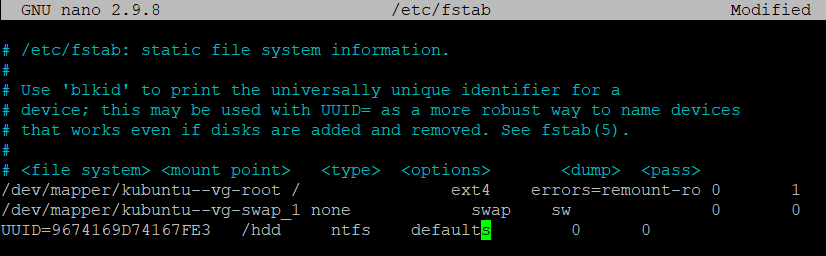

# Mounting a 2nd HDD

Create a Mount point for the disk
`sudo mkdir /hdd` 

Check the system can see the disk
`sudo lsblk`
You will see an out put of all attached disks

Take note of the disk letter, in this case "sdb" and partition "sdb1"
Now we need to find the UUID of the partition
`sudo blkid sdb1`
It should the output some information about the specified parition

Take note of the UUID

Open up /etc/fstab file
`sudo nano /etc/fstab`
Append a line to the bottom following the format
<pre>UUID="YOUR UUID HERE"  $Mountpoint     $FileSystem     default     0    0</pre>
It should look like

Mount the drive with
`sudo mount -a `
