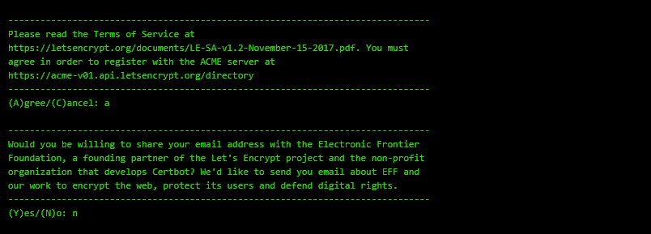
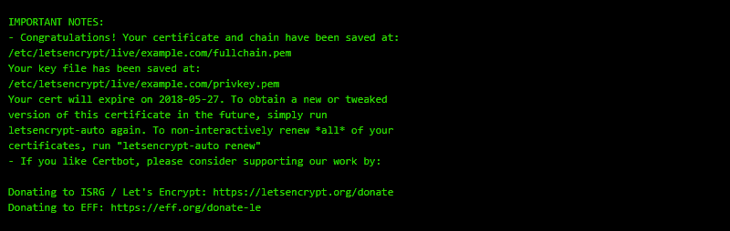

## Index

- Overview
- Setup
  - [Installing Certbot](#installing-certbot)
  - [Generating Certificates](#generating-certificates)
  - [Editing Server Blocks](#editing-server-blocks)
  - [Redirecting Traffic to HTTPS](#redirecting-to-https)
- Testing

## Setup

##### Installing Certbot

Install Python and Common Software  
`apt-get install software-properties-common`  
Add in the Certbot Repository  
`add-apt-repository ppa:certbot/certbot`  
Update Apt Cache  
`apt-get update`  
Install Certbot  
`apt-get install certbot python-certbot-nginx` 

##### Generating Certificates  

Generate your first certificate, this certifacte will work for all listed sites.  
`sudo certbot certonly --nginx -d example.com -d www.example.com`

When prompted, specify an administrative email address. This will allow you to regain control of a lost certificate and receive urgent security notices if necessary. 

Agree to the Terms of Service and specify if you would like to share your email address with E.F.F 

You will then get a notice confirming your newly generated certificates. 
The will go into `/etc/letsencrpyt/live/$server_name/` 

##### Editing Server Blocks

To use our newly generated certificates we need to edit our Nginx Server block to listen on port 443 and tell Nginx where the certs are located.  

Create a new server listening on port 443 and include to SSL parameter like below

For Nginx to be able to function under SSL and make use of our new certs, we have to point to each of the components that make up the ssl certificates.  

For example 

##### Redirecting to HTTPS
Now that we have the server listening on port 443 and serving up traffic secured by SSL, we want to force all incoming traffic onto https.

To do this we setup at new server listening on port 80.
Once traffic hits this server it is then redirected to use the HTTPS version of the URL.

Redirect Example

##### Server Block
Below is an example server block in its entirety

    server{  
        listen 443 ssl;  
        listen [::]:443 ssl;  

        server_name example.technicalkiwi.com;

        # SSL
        ssl_certificate /etc/letsencrypt/live/example.technicalkiwi.com/fullchain.pem;
        ssl_certificate_key /etc/letsencrypt/live/example.technicalkiwi.com/privkey.pem;
        ssl_trusted_certificate /etc/letsencrypt/live/example.technicalkiwi.com/chain.pem;

        location / {
                proxy_pass http://localhost:5001;
                proxy_set_header Host $http_host;
                proxy_set_header X-Fowarded_for $remote_addr;
        }  
    }  

        #Http Redirect  
    server{  
        listen 80;  
        listen [::]:80;

        server_name example.technicalkiwi.com www.example.technicalkiwi.com;

        location / {
                return 301 https://example.technicalkiwi.com$request_uri;

        }
    }

