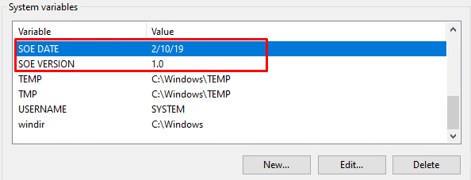
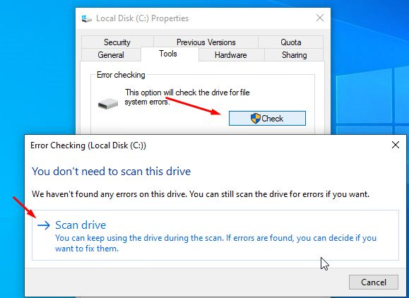
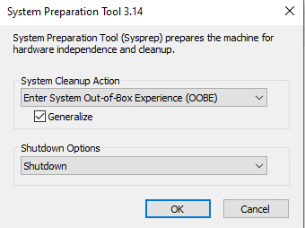

## Capturing the Image

- Prepare the OS
    - Remove old Snapshots
	- Add in capture Disk
    - Clean Drive/Error Check
    - Change Enviroment Build Value

 
- Create Snapshot  
 
- Run Sysprep
	- Audit Mode
	- Generalized
	- Reboot  

 
- Run Scandisk C:\

- Clean Logs  
 
- Create Another snapshot
 
- Run Sysprep
	- OOBE
	- Generalized
	- Shutdown

Boot to WDS
Capture Image to Local Storage
